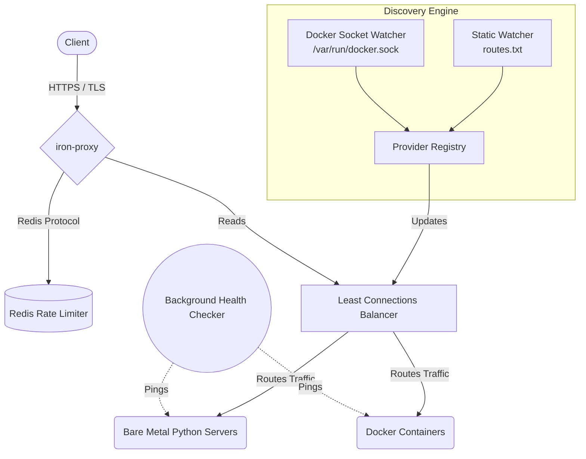

# iron-proxy 🛡️

> **Why iron-proxy?**  
> Modern infrastructure is fractured. Startups run everything in containers, while legacy enterprises rely on bare-metal servers. `iron-proxy` bridges the gap. It is a high-performance, asynchronous API Gateway built in Rust that seamlessly routes traffic across both dynamic Cloud Native environments (Docker) and legacy static servers simultaneously, all secured behind military-grade TLS termination.


---

## Table of Contents

- [Architecture](#architecture)
- [Description](#description)
- [Installation](#installation)
- [Usage](#usage)
- [License](#license)
- [Credits](#credits)

---

## Architecture



---

## Description

`iron-proxy` is a hybrid-cloud Ingress Controller designed for zero-downtime environments.

It features:

- **Hybrid Discovery:** A dual-engine provider system that hot-reloads static IPs from a GitOps-friendly text file while actively listening to the Docker socket for container lifecycle events.
- **Smart Routing:** Least-connections load balancing ensures no single backend is overwhelmed.
- **Self-Healing:** A background asynchronous health checker actively probes backends and silently drops failing instances without dropping client TCP connections.
- **DDoS Protection:** Distributed, Redis-backed rate limiting to throttle abusive traffic.
- **Security First:** End-to-end TLS termination prevents unencrypted data leaks.

---

## Installation

> [!WARNING]
> **Dependencies Required**  
> Ensure you have `rustc`, `cargo`, `docker`, and `redis-server` installed on your host machine before building.

### Clone the Repository

```bash
git clone https://github.com/thecoderbee/iron-proxy.git
cd iron-proxy
```

### Generate TLS Certificates

`iron-proxy` requires an OpenSSL certificate to handle HTTPS traffic.

Generate a local self-signed certificate for development:

```bash
openssl req -x509 -newkey rsa:4096 -keyout key.pem -out cert.pem -sha256 -days 365 -nodes -subj "/CN=localhost"
```

### Start Redis

```bash
docker run -d -p 6379:6379 redis:alpine
```

### Build the Gateway

```bash
cargo build --release
```

---

## Usage

> [!NOTE]
> The Gateway will start empty. You must provide it with routing targets via either the Static Provider or the Dynamic Docker Provider.

### 1. Start the Gateway

```bash
cargo run --release
```

### 2. Add Static Bare-Metal Targets

Create a `routes.txt` file in the project root:

```text
# routes.txt
127.0.0.1:9000
127.0.0.1:9001
```

The Gateway will hot-reload instantly.

### 3. Add Dynamic Docker Targets

Spin up a container and attach the `iron-proxy` labels.

```bash
docker run -d \
  --name my-backend \
  --label "iron-proxy=true" \
  --label "iron-proxy.port=3000" \
  grafana/grafana:latest
```

The Gateway will intercept Docker socket events and instantly add the container to the routing table.

### 4. Test the Connection

```bash
curl -k -I https://localhost:8080
```

---

## License

This project is licensed under the **MIT License** — see the `LICENSE` file for details.

---

## Credits

Built with ❤️ using **Rust**, **Docker**, and **Redis**.
=======
# 🛡️ Iron-Proxy


A high-performance, concurrent, dual-engine (L4/L7) reverse proxy and load balancer engineered in Rust. 

Iron-Proxy is designed for modern enterprise infrastructure, featuring mathematical latency-aware routing, automatic request resilience, and zero-downtime operations. Built on top of `tokio` and `hyper`, it safely multiplexes raw TCP streams alongside HTTP traffic without blocking the main event loop.

## ✨ Enterprise Features

* **Dual-Engine Multiplexing:** Run raw Layer 4 (TCP) and Layer 7 (HTTP) proxies side-by-side from a single binary.
* **Advanced Load Balancing:** Lock-free, highly concurrent routing using **Peak EWMA** (Exponentially Weighted Moving Average) for HTTP, **Least Connections** for TCP, and **IP Hashing** for stateful Sticky Sessions.
* **Zero-Downtime Hot Reloading:** Modify your `iron-proxy.toml` on the fly. The proxy watches for file system events and safely swaps configuration states without dropping active client connections.
* **Self-Healing Resilience:** Features asynchronous background health checks and automatic L7 request retries with in-memory body buffering for 5xx backend errors.
* **First-Class Observability:** Native Prometheus `/metrics` endpoint and strict, structured JSON telemetry for seamless Datadog/Grafana integration.
* **Unix Daemonization:** Production-ready CLI with native background process management.

---

## ⚙️ Architecture & Internals

Iron-Proxy is architected for **maximum throughput** and **minimal tail latency**.

---

### 🔒 Lock-Free State Management

The internal `ConnectionTracker` uses:

- `DashMap` for concurrent shared state
- Raw 64-bit atomic floating-point math via `AtomicU64` bit-casting

This enables latency metrics to be updated in **sub-microsecond time** without traditional `Mutex` thread locking.

```text
Atomic updates → zero lock contention → lower tail latency
```

## 💻 Command Line Interface

| Command | Description |
|---------|-------------|
| `init` | Generates a standard `iron-proxy.toml` template |
| `start` | Forks the process and runs the proxy in daemon mode |
| `stop` | Gracefully stops the daemon via `SIGTERM` |
| `status` | Queries the Admin API for real-time backend health |
| `check` | Validates TOML syntax without opening ports |
| `run` | Runs the proxy in the foreground (Docker/systemd friendly) |

---


## 🚀 Quick Start

### Installation
Pre-compiled binaries for Linux, macOS (Apple Silicon/Intel), and Windows are available.

1. Download the latest binary from the [Releases](../../releases) tab.
2. Extract the executable and add it to your system `$PATH`.

*(Alternatively, build from source: `cargo install --path .`)*

### Running the Proxy

Generate the default configuration file in your current directory:
```bash
iron-proxy init
```

Start the proxy in the background (Daemon mode):
```bash
iron-proxy start
```
Check the real-time cluster status:
```bash
iron-proxy status
```
>>>>>>> dev
